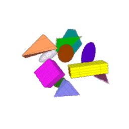

<h1 align="center"> 3D Mask R-CNN </h1>

Based on the [2D implementation](https://github.com/matterport/Mask_RCNN) by Matterport, Inc, [this update](https://github.com/ahmedfgad/Mask-RCNN-TF2) and [this fork](https://github.com/matterport/Mask_RCNN/pull/1611/files).

This 3D implementation was written by Gabriel David (LIRMM, Montpellier, France). Most of the code inherits from the MIT Licence edicted by Matterport, Inc (see core/LICENCE).

This repository is linked to the paper:

We adopt a Docker approach to simplify the distribution and reproduction of our work. Running this 3D Mask R-CNN without our image is possible but requires to install TensorFlow sources and to compile the 3D Non Max Suppression and 3D Crop And Reisze custom operations by hand.

The implementation for the Phallusia mammillata dataset can be found in the [morphogenesis branch.](https://github.com/gdavid57/3d-mask-r-cnn/tree/morphogenesis)

# Toy Dataset

This section aims to reproduce the results of the paper mentioned above on the toy dataset. Note that the input image signal was enhaced for the sake of visualization. Please follow the default commands below.

Representations of pair ground truth instance segmentation and input image:

<p align="center">
    
</p>

Clone this repository and access cloned directory with:

```
git clone https://github.com/gdavid57/3d-mask-r-cnn.git
cd 3d-mask-r-cnn
```

## Generate toy data and datasets

Execute the following command to generate the Toy Dataset example:

```
docker run -it --volume $PWD:/workspace gdavid57/3d-mask-r-cnn python -m generate_data --train_dir "./data/" --thread_nb 1 --train_image_nb 10000 --image_size 128
```

The parameters are explained as follows:

+ --train_dir: This argument specifies the directory where the data for training will be stored. The default value is './data/'.
+ --thread_nb: This argument specifies the number of threads you want to run for your experiment. The default value is 1.
+ --train_image_nb: This argument specifies the number of training images you want to generate for your experiment. The default value is 10000.
+ --image_size: This argument specifies the size of the images to be generated for your experiment. The default value is 128.

Default generation will produce ~18Go of data.

The train and test datasets are generated thanks to the script *generate_datasets.py* following the command line syntaxe:

```
docker run -it --volume $PWD:/workspace gdavid57/3d-mask-r-cnn python -m generate_datasets --data_dir "./data/" --test_size 0.05
```

The parameters are:

+ --data_dir: This argument specifies the directory where the data for training are stored. The default value is './data/'.
+ --test_size: This argument specifies the ratio of training examples assigned to the test subset. The default value is 0.05.

## Region Proposal Network training

The RPN is train with the command:

```
docker run -it --gpus "0" --volume $PWD:/workspace gdavid57/3d-mask-r-cnn python -m main --task "RPN_TRAINING" --config_path "configs/rpn/scp_rpn_config.json" --summary
```

The parameters being:

+ --config: RPN training config. See *scp_rpn_config.json* or *core/config.py* for more details.
+ --summary: if True, display RPN keras model summary, number of examples in train and test datasets, as well as the training config.

By default, training weights are stored in *weights/scp_rpn/*.

## Head target generation

As we train the Mask R-CNN in two steps (RPN first and Head after), we advice to generate the proper Head targets in order to speed its training. These targets correspond to the output of the RPN and RoIAlign step. It can be easily achieved by running the *generate_head_targets.py* script as follows:

```
docker run -it --gpus "0" --volume $PWD:/workspace gdavid57/3d-mask-r-cnn python -m main --task "TARGET_GENERATION" --config_path "configs/targeting/scp_target_config.json"
```

The parameters being:

+ --config: RPN targeting config. See *scp_target_config.json* or *core/config.py* for more details.
+ --summary: if True, display RPN keras model summary, number of examples in train and test datasets, as well as the given config.

By default, targets are generated from the 20th epoch of the RPN training and are saved under *data/scp_target/* location.

## Head training

The script *head_training.py* allows to train the Head part of the Mask R-CNN thanks to:
```
docker run -it --gpus "0" --volume $PWD:/workspace gdavid57/3d-mask-r-cnn python -m main --task "HEAD_TRAINING" --config_path "configs/heads/scp_heads_config.json" --summary
```

with

+ --config: Head training config. See *scp_heads_config.json* or *core/config.py* for more details.
+ --summary: if True, display Head keras model summary, number of examples in train and test datasets, as well as the training config.

## Mask R-CNN evaluation

Once the RPN and the Head have been trained, one can evaluate the performance of the whole Mask R-CNN with the script *mrcnn_evaluation.py* and the command line:

```
docker run -it --gpus "0" --volume $PWD:/workspace gdavid57/3d-mask-r-cnn python -m main --task "MRCNN_EVALUATION" --config_path "configs/mrcnn/scp_mrcnn_config.json" --summary
```

where

+ --config: whole Mask R-CNN config. See *scp_mrcnn_config.json* or *core/config.py* for more details.
+ --summary: if True, display the Mask R-CNN keras model summary, number of examples in train and test datasets, as well as the given config.

By default, the predicted instance segmentation are saved under *data/results/* and results such as mAP, precision and recall are gathered in the *report.csv* in the same folder.


# Troubleshooting

+ A recent version of Docker must be installed. See [here](https://docs.docker.com/engine/install/) for Docker installation. Follow the post-installation instructions to add current user to docker group.

+ In case of custom op error, please compile the 3D Non Max Suppression and 3D Crop And Resize on your own computer following [this tutorial](https://github.com/gdavid57/3d-nms-car-custom-op). The generated wheel archive should then be placed in core/custom_op/ of this repo, and the image must be rebuilt with

```
docker build -t IMAGE_NAME .
```

by replacing IMAGE_NAME by the name of your choice. Finally, you can use all the previous commands by changing the gdavid57/3d-mask-r-cnn by your image name.

+ In case of other problem, please open an Issue.